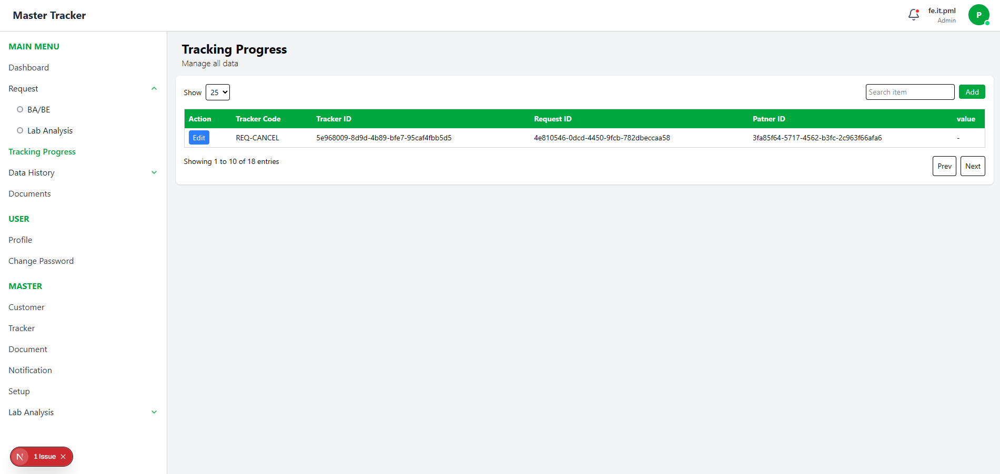

This is a [Next.js](https://nextjs.org) project bootstrapped with [`create-next-app`](https://github.com/vercel/next.js/tree/canary/packages/create-next-app).

## Getting Started

First, run the development server:

```bash
npm run dev
# or
yarn dev
# or
pnpm dev
# or
bun dev
```
Open [http://localhost:3000](http://localhost:3000) with your browser to see the result.

# Techstack
  
  
  
 

| Teknologi                           | Kegunaan                              |
| ----------------------------------- | ------------------------------------- |
| **Next.js**                         | Framework React untuk SSR dan routing |
| **React**                           | Library UI utama                      |
| **Zustand**                         | State management global ringan        |
| **Tailwind CSS**                    | Styling responsive dan modern         |
| **JavaScript**                      | Bahasa pemrograman utama              |

# 📂 CRUD Flow (Request / Tracker)
Read → Tampilkan di table / list.
Create → Form input → simpan ke store atau API.
Update → Klik edit → update store / API.
Delete → Klik delete → hapus dari store / API.

# ⚡ Struktur Project
src/
 └─ app/
     ├─ login/
     ├─ master/
     │    ├─ tracker/
     │    │    ├─ [id]/
     │    │    │   └─ page.jsx
     │    │    ├─ create/
     │    │    │   └─ page.jsx
     │    │    └─ page.jsx
     │    └─ request/
     │         └─ ca   (mungkin belum selesai)
 └─ tracker/
      ├─ [id]/page.jsx
      ├─ create/page.jsx
      └─ page.jsx
components/
 ├─ Card.jsx
 ├─ Icons.jsx
 ├─ Navbar.jsx
 ├─ Sidebar.jsx
 └─ TableRequest.jsx
globals.css
layout.jsx
not-found.jsx
page.jsx


# Auth
## Login

- Login berjalan dengan lancar menggunakan :
    - username : fe.it.pml
    - password : Password123?
### Error Login
- kendala login sebagai berikut :
    1. ketika password salah server masih merespon dengan 200 OK
    2. ketika token access telah habis, endpoint /token/refresh akan mengembalikan 401 jika menggunakan token refresh yang didapat dari login, akan tetapi jika menggunakan token access yang masih aktif, endpoint tersebut mengembalikan token yang baru.
    
## Logout

- Logout bisa digunakan untuk keluar dari akun yang sudah login, berjalan dengan baik tanpa kendala


# TRACKER & REQUEST PAGE
- page Tracker $ Request Memiliki fungsi dan Kendala yang sama, dimana fitur dan kendalanya sebagai berikut :


## Create


- Create berjalan dengan baik, hanya saja kadang butuh waktu yang lama untuk data baru bisa masuk ke database dan ditampilkan kembali

## Read

- Read bisa menampilkan semua data 
### Error Read
- Icon tidak bisa ditampilkan karena tidak ada keterangan implementasi string yang dikembalikan server, seperti nama library atau element

### Update


- Update dapat berjalan dengan baik

### Delete


- Delete dapat berjalan dengan baik

## Error Tracker & Request Page
- error ada di pagination dan search, begitu juga dengan semua pagination di endpoint lain, semua terkendala di pagination , search, limit, dll


# Tracking Page

- Tracking Page bisa menampilkan data dengan baik, akan tetapi
### Error Tracking Page

- Semua Fitur selain GET dan GETbyID semuanya error termasuk POST,PUT dan DELETE

